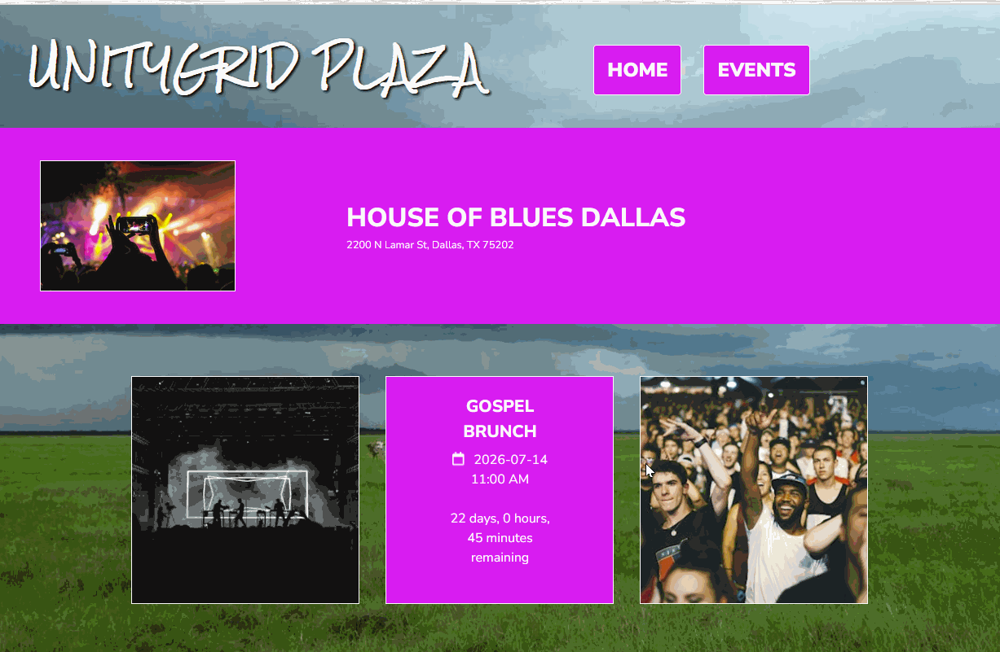

# WEB103 Project 3 - UnityGrid Plaza

Submitted by: **William Galindo**

About this web app: **UnityGrid Plaza is a virtual community space for exploring live events across four Dallas venues. Users click an interactive map to view venue details and upcoming or past events, with live countdown timers and a full events page to filter and sort by location.**

Time spent: **8** hours

## Required Features

The following **required** functionality is completed:

- [x] **The web app uses React to display data from the API**
- [x] **The web app is connected to a PostgreSQL database, with an appropriately structured Events table**
  - [x]  **NOTE: Your walkthrough added to the README must include a view of your Render dashboard demonstrating that your Postgres database is available**
  - [x]  **NOTE: Your walkthrough added to the README must include a demonstration of your table contents. Use the psql command 'SELECT * FROM tablename;' to display your table contents.**
- [x] **The web app displays a title.**
- [x] **Website includes a visual interface that allows users to select a location they would like to view.**
  - [x] *Note: A non-visual list of links to different locations is insufficient.* 
- [x] **Each location has a detail page with its own unique URL.**
- [x] **Clicking on a location navigates to its corresponding detail page and displays list of all events from the `events` table associated with that location.**

The following **optional** features are implemented:

- [x] An additional page shows all possible events
  - [x] Users can sort *or* filter events by location.
- [x] Events display a countdown showing the time remaining before that event
  - [x] Events appear with different formatting when the event has passed (ex. negative time, indication the event has passed, crossed out, etc.).

The following **additional** features are implemented:

- [x] Express REST API with separate controllers and routes for locations and events
- [x] Live countdown timers that update every second on event cards
- [x] Seeded database with four Dallas venues and twelve sample events (mix of past and future dates)

## Video Walkthrough

Here's a walkthrough of implemented required features:

GIF created with ScreenToGif

## Notes

The app connects to a Render PostgreSQL database using environment variables in `server/.env`. Run `node config/reset.js` from the `server` directory to create and seed the `locations` and `events` tables.

Venue routes:
- `/echolounge` — Echo Lounge
- `/houseofblues` — House of Blues Dallas
- `/pavilion` — Dos Equis Pavilion
- `/americanairlines` — American Airlines Center

Challenges encountered included configuring Render database credentials, resolving port 3000 conflicts during local development, and wiring the frontend API services to the Express backend through Vite's `/api` proxy.

## License

Copyright 2026 Your name here

Licensed under the Apache License, Version 2.0 (the "License"); you may not use this file except in compliance with the License. You may obtain a copy of the License at

> http://www.apache.org/licenses/LICENSE-2.0

Unless required by applicable law or agreed to in writing, software distributed under the License is distributed on an "AS IS" BASIS, WITHOUT WARRANTIES OR CONDITIONS OF ANY KIND, either express or implied. See the License for the specific language governing permissions and limitations under the License.
